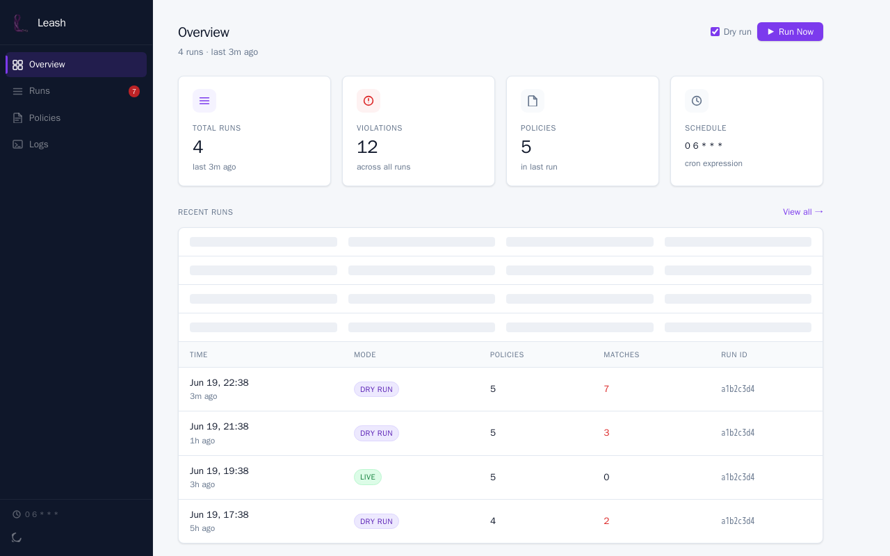
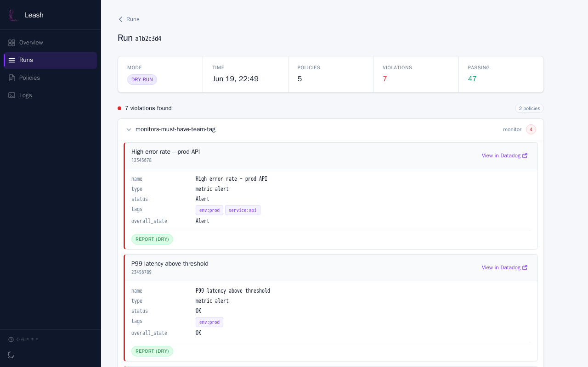
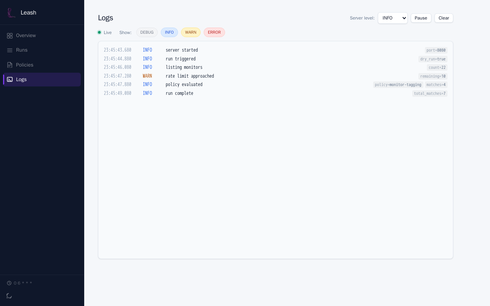
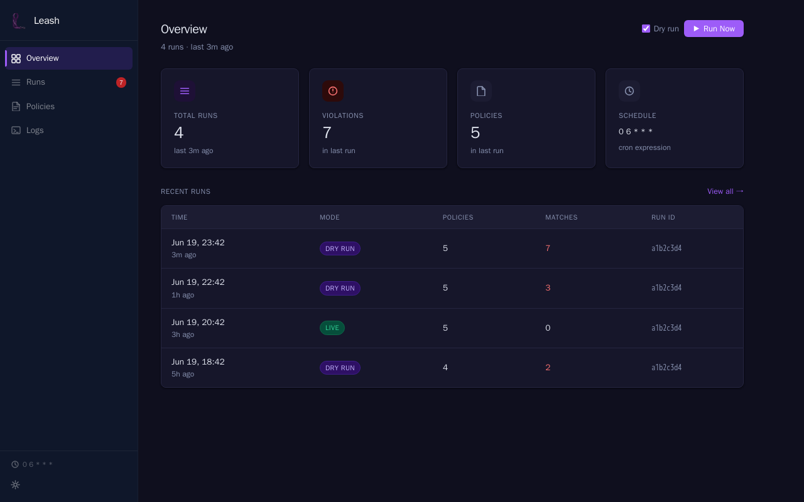

# Leash

Leash is a governance-as-code framework for Datadog. Define policies in YAML — Leash scans your Datadog organization and reports (or remediates) resources that violate them.

Inspired by [Cloud Custodian](https://cloudcustodian.io).

**Website:** [mbaitelman.github.io/leash](https://mbaitelman.github.io/leash/)

## UI

`leash serve` exposes a web UI for running policies, browsing results, and editing policy files — with live log streaming and dark mode.

| Overview | Run detail |
|---|---|
|  |  |

| Logs | Dark mode |
|---|---|
|  |  |

---

```yaml
policies:
  - name: prod-monitors-must-have-team-tag
    description: Every production monitor needs an owning team.
    resource: datadog.monitor
    filters:
      - type: tag
        key: env
        value: prod
        op: present
      - type: tag
        key: team
        op: absent
    actions:
      - type: report
      - type: notify
        channel: slack
```

---

## How it works

1. Write a policy YAML file describing a **resource type**, **filters** that select matching resources, and **actions** to take on them.
2. Run `leash run` — Leash queries the Datadog API, applies your filters, and executes the actions.
3. Findings are emitted as structured JSON, ready for dashboards or alerting pipelines.

By default every run is a **dry run** — mutating actions (tag, delete) are logged but not executed unless you opt in with `--dry-run=false`.

---

## Quick start

### Docker (recommended)

```bash
# Pull the image
docker pull ghcr.io/mbaitelman/leash:latest

# Copy and fill in your credentials
cp .env.example .env

# Validate policies
docker run --rm \
  --env-file .env \
  -v $(pwd)/policies:/policies:ro \
  ghcr.io/mbaitelman/leash:latest validate --policy /policies/

# Run in dry-run mode (default)
docker run --rm \
  --env-file .env \
  -v $(pwd)/policies:/policies:ro \
  ghcr.io/mbaitelman/leash:latest run --policy /policies/
```

### Build from source

Requires Go 1.26+.

```bash
git clone https://github.com/mbaitelman/leash
cd leash
go mod tidy
go build -o leash ./cmd/leash
./leash --help
```

---

## Authentication

Leash reads credentials from environment variables:

| Variable | Required | Description |
|---|---|---|
| `DD_API_KEY` | Yes | Datadog API key |
| `DD_APP_KEY` | Yes | Datadog Application key |
| `DD_SITE` | No | Datadog site (default: `datadoghq.com`) |
| `SLACK_WEBHOOK_URL` | No | Fallback Slack webhook for `notify` actions |
| `LEASH_SCHEDULE` | No | Cron expression for automatic runs in `serve` mode (e.g. `0 * * * *`) |

See [docs/auth.md](docs/auth.md) for key creation, regional sites, and secrets management.

---

## Writing policies

> Full syntax reference: [docs/policies.md](docs/policies.md)

A policy file is a YAML document with a top-level `policies` list. Each policy has:

```yaml
policies:
  - name: string           # required — unique identifier
    description: string    # optional
    resource: string       # required — see Resource types below
    filters: []            # optional — all filters AND-ed together
    actions: []            # optional — executed in order on each match
```

### Resource types

| Name | Datadog entity |
|---|---|
| `datadog.monitor` | Monitors (metric, log, APM, composite) |
| `datadog.slo` | Service Level Objectives |
| `datadog.synthetic` | Synthetic API and browser tests |
| `datadog.dashboard` | Dashboards |
| `datadog.user` | User accounts |
| `datadog.rum_application` | RUM applications |
| `datadog.rum_retention_filter` | RUM retention filters (one resource per filter per app) |

### Filters

Filters are AND-ed together by default. Every resource that passes all filters is a match.

**Value filter** — compare any field using dot-notation:

```yaml
- type: value
  key: name          # field path (see each resource's available keys below)
  op: regex          # eq | ne | gt | lt | gte | lte | contains | not-contains
                     # regex | not-regex | in | not-in | present | absent
  value: "^\\[PROD\\]"
```

**Tag filter** — convenience filter for Datadog tag arrays (`key:value` strings):

```yaml
- type: tag
  key: env
  value: prod        # omit to check presence only
  op: present        # present (default) | absent | eq
```

**Age filter** — time-based filtering on date fields:

```yaml
- type: age
  key: modified
  op: older-than     # older-than | newer-than
  value: "30d"       # supports Go durations + "d" for days: 24h, 7d, 90d
```

**Boolean meta-filters** — combine filters with `and`, `or`, `not`:

```yaml
filters:
  - or:
      - type: tag
        key: env
        value: prod
      - type: tag
        key: env
        value: staging
  - not:
      - type: value
        key: name
        op: regex
        value: "^\\[REVIEWED\\]"
```

### Actions

| Action | Mutating | Description |
|---|---|---|
| `report` | No | Print matched resource to stdout; always runs |
| `notify` | No | POST a message to a Slack webhook |
| `tag` | Yes | Add tags to matched resources; optionally remove them from passing resources (`remove_on_pass: true`) |
| `delete` | Yes | Delete the resource (requires `confirm: true` in YAML) |

**report:**
```yaml
- type: report
```

**notify:**
```yaml
- type: notify
  channel: slack
  webhook_url: "https://hooks.slack.com/services/..."
  # Falls back to SLACK_WEBHOOK_URL environment variable
```

**tag:**
```yaml
- type: tag
  tags:
    - "compliance:violation"
    - "leash:flagged"
  remove_on_pass: true   # optional — removes these tags once the resource passes the policy
```

**delete** (requires two explicit opt-ins):
```yaml
- type: delete
  confirm: true    # Must be in the YAML
  # AND --dry-run=false must be passed on the CLI
```

---

## CLI reference

All commands accept these persistent flags:

```
-p, --policy stringArray     Policy file(s) or directory (default: ./policies)
    --dry-run bool           Simulate mutations; don't call write APIs (default: true)
    --output-format string   json | text (default: json)
    --log-level string       debug | info | warn | error (default: info)
```

### `leash run`

Execute policies and emit a findings report.

```bash
leash run --policy ./policies/
leash run --policy ./policies/monitor-naming.yaml --dry-run=false
leash run --policy ./policies/ --output-format text
leash run --policy ./policies/ --output-file findings.json
```

Additional flags:
```
--output-file string   Write findings JSON to a file instead of stdout
```

### `leash validate`

Parse and validate policy files without hitting the Datadog API. Useful in CI.

```bash
leash validate --policy ./policies/
```

Exits 0 on success, non-zero with error details on any validation failure.

### `leash list-resources`

Print all registered resource types.

```bash
leash list-resources
```

### `leash schema`

Print the JSON Schema for policy YAML files to stdout. Pipe to a file for editor integration.

```bash
leash schema > policy-schema.json
```

### `leash serve`

Start the web UI on localhost. Optionally runs policies on a cron schedule automatically.

```bash
leash serve
leash serve --port 9090
leash serve --schedule "0 * * * *"          # trigger a run every hour
leash serve --schedule "*/30 * * * *"       # every 30 minutes
LEASH_SCHEDULE="0 6 * * *" leash serve     # daily at 06:00 via env var
```

Additional flags:
```
--host string       Bind address (default: all interfaces; use 127.0.0.1 to restrict to localhost)
--port string       Port to listen on (default "8080")
--runs-dir string   Directory for storing run results (default "./runs")
--schedule string   Cron expression for automatic runs (overrides LEASH_SCHEDULE env var)
```

**Schedule precedence:** `--schedule` flag → `LEASH_SCHEDULE` env var → no automatic runs.

> **Security note:** the web UI has no built-in authentication — it can trigger live (non-dry-run) actions and edit policy files. By default it listens on all interfaces; use `--host 127.0.0.1` to keep it local, or put an authenticating reverse proxy in front of it before exposing it beyond your machine. Cross-origin browser requests to the API are rejected.

The schedule uses standard 5-field cron syntax: `minute hour day month weekday`. An invalid expression is rejected at startup before the server begins accepting connections. Each scheduled run uses the same dry-run setting as the server (`--dry-run`, default `true`) and saves its findings to `--runs-dir` like any manual run.

---

## Findings output format

`leash run` emits a `FindingsReport` JSON document — the stable API contract for downstream consumers and a future UI:

```json
{
  "run_id": "a3f2c1d4-...",
  "generated_at": "2026-06-18T12:00:00Z",
  "dry_run": true,
  "policies": [
    {
      "policy_name": "prod-monitors-must-have-team-tag",
      "resource": "datadog.monitor",
      "match_count": 3,
      "matches": [
        {
          "id": "12345678",
          "properties": {
            "name": "High error rate",
            "tags": ["env:prod", "service:api"],
            "overall_state": "OK"
          }
        }
      ],
      "actions_taken": [
        {
          "resource_id": "12345678",
          "action_type": "report",
          "dry_run": true,
          "success": true
        }
      ]
    }
  ]
}
```

---

## Resource field reference

### `datadog.monitor`

| Key | Type | Description |
|---|---|---|
| `id` | int64 | Monitor ID |
| `name` | string | Monitor name |
| `message` | string | Notification message |
| `query` | string | Monitor query |
| `type` | string | e.g. `metric alert`, `log alert` |
| `tags` | []string | Tag list |
| `created` | time.Time | Creation timestamp |
| `modified` | time.Time | Last modified timestamp |
| `overall_state` | string | `OK`, `Alert`, `Warn`, `No Data` |
| `creator.email` | string | Email of the user who created the monitor |
| `creator.handle` | string | Datadog handle of the creator |
| `options.notify_no_data` | bool | No-data alerting enabled |
| `options.require_full_window` | bool | Requires a full evaluation window before alerting |
| `options.thresholds.critical` | float64 | Critical threshold value |

### `datadog.slo`

| Key | Type | Description |
|---|---|---|
| `id` | string | SLO ID |
| `name` | string | SLO name |
| `description` | string | Description |
| `type` | string | `metric`, `monitor`, `time_slice` |
| `tags` | []string | Tag list |
| `created` | time.Time | Creation timestamp |
| `modified` | time.Time | Last modified timestamp |
| `creator.email` | string | Creator's email |

### `datadog.synthetic`

| Key | Type | Description |
|---|---|---|
| `public_id` | string | Test public ID |
| `name` | string | Test name |
| `type` | string | `api` or `browser` |
| `status` | string | `live` or `paused` |
| `tags` | []string | Tag list |
| `creator.email` | string | Creator's email |
| `monitor_id` | int64 | ID of the monitor Datadog auto-creates for the test |
| `synthetic.slo_linked` | bool | `true` if the test's monitor is referenced by at least one SLO; **absent** (not `false`) when not linked — use `op: absent` to find unlinked tests |

### `datadog.dashboard`

| Key | Type | Description |
|---|---|---|
| `id` | string | Dashboard ID |
| `title` | string | Dashboard title |
| `author_handle` | string | Author's email/handle |
| `creator.email` | string | Same as `author_handle`; use this for cross-resource consistency |
| `description` | string | Description |
| `layout_type` | string | `ordered` or `free` |
| `url` | string | Relative URL path (e.g. `/dashboard/abc-123`) |
| `tags` | []string | Tag list |
| `created` | time.Time | Creation timestamp |
| `modified` | time.Time | Last modified timestamp |

### `datadog.user`

| Key | Type | Description |
|---|---|---|
| `id` | string | User ID |
| `email` | string | Email address |
| `name` | string | Display name |
| `title` | string | Job title |
| `status` | string | `Active`, `Pending`, `Disabled` |
| `disabled` | bool | Whether the account is disabled |
| `service_account` | bool | Whether this is a service account |
| `created` | time.Time | Account creation timestamp |
| `modified` | time.Time | Last modified timestamp |

### `datadog.rum_application`

| Key | Type | Description |
|---|---|---|
| `id` | string | Application ID |
| `name` | string | Application name |
| `type` | string | `browser`, `ios`, `android`, `react-native`, `flutter`, `roku`, `electron`, `unity`, `kotlin-multiplatform` |
| `is_active` | bool | Whether the application is active and collecting data |
| `creator.email` | string | Handle of the user who created the application |
| `created` | time.Time | Creation timestamp |
| `updated` | time.Time | Last updated timestamp |
| `updated_by_handle` | string | Handle of the user who last updated the application |
| `product_scales.rum_processing_state` | string | Event processing scale: `ALL`, `ERROR_FOCUSED_MODE`, or `NONE` |
| `product_scales.analytics_retention_state` | string | Product analytics retention: `MAX` or `NONE` |

### `datadog.rum_retention_filter`

Each retention filter is a separate resource. Use `app_id` to correlate back to a `datadog.rum_application`.

| Key | Type | Description |
|---|---|---|
| `id` | string | Filter ID |
| `app_id` | string | Parent RUM application ID |
| `app_name` | string | Parent RUM application name |
| `name` | string | Filter name |
| `enabled` | bool | Whether the filter is active |
| `event_type` | string | `session`, `view`, `action`, `error`, `resource`, `long_task` |
| `query` | string | RUM search query scoping this filter |
| `sample_rate` | float64 | Sampling rate (0.1–100) |

---

## Extending Leash

Adding a new resource type, filter, or action requires creating one new file with a self-registering `init()` function. No changes to the engine or CLI are needed.

See the existing implementations in `internal/resource/`, `internal/filter/`, and `internal/action/` as patterns to follow.

---

## Docs

- [Policy syntax](docs/policies.md) — Complete filter/action reference, all ops, resource field tables, examples
- [Authentication](docs/auth.md) — API keys, App keys, regions, secrets management
- [Provisioning keys with pup](docs/pup.md) — Use Datadog's official CLI to create and rotate keys
- [Testing](docs/testing.md) — Unit testing, dry-run, CI integration, integration testing
